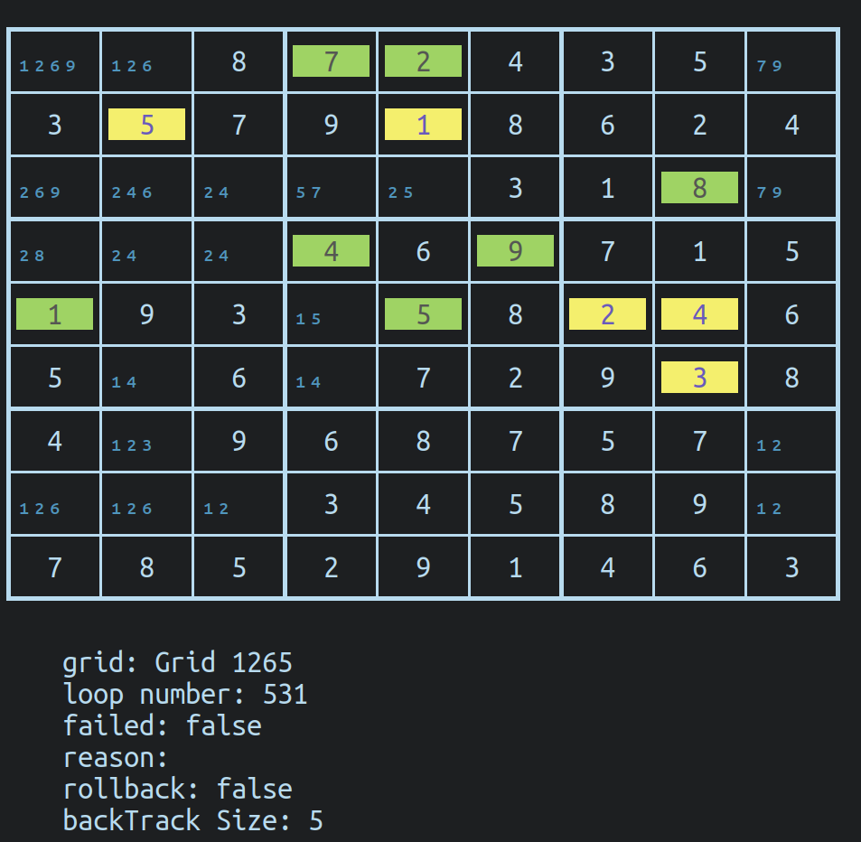

# Sudoku solver

The solver only know the basic rules: 1 to 9 digits per line, columns and box

kinda use the collapsing wave function, determining the entropy of each cell

Add some backtracking when random choices needs to be made

It's made to be run in a proper terminal, with color and stuff: 

```
┏━━━━━┯━━━━━┯━━━━━┳━━━━━┯━━━━━┯━━━━━┳━━━━━┯━━━━━┯━━━━━┓
┃₁₂₆₉ │₁₂₆  │  8  ┃  7  │  2  │  4  ┃  3  │  5  │₇₉   ┃
┠─────┼─────┼─────╂─────┼─────┼─────╂─────┼─────┼─────┨
┃  3  │  5  │  7  ┃  9  │  1  │  8  ┃  6  │  2  │  4  ┃
┠─────┼─────┼─────╂─────┼─────┼─────╂─────┼─────┼─────┨
┃₂₆₉  │₂₄₆  │₂₄   ┃₅₇   │₂₅   │  3  ┃  1  │  8  │₇₉   ┃
┣━━━━━┿━━━━━┿━━━━━╋━━━━━┿━━━━━┿━━━━━╋━━━━━┿━━━━━┿━━━━━┫
┃₂₈   │₂₄   │₂₄   ┃  4  │  6  │  9  ┃  7  │  1  │  5  ┃
┠─────┼─────┼─────╂─────┼─────┼─────╂─────┼─────┼─────┨
┃  1  │  9  │  3  ┃₁₅   │  5  │  8  ┃  2  │  4  │  6  ┃
┠─────┼─────┼─────╂─────┼─────┼─────╂─────┼─────┼─────┨
┃  5  │₁₄   │  6  ┃₁₄   │  7  │  2  ┃  9  │  3  │  8  ┃
┣━━━━━┿━━━━━┿━━━━━╋━━━━━┿━━━━━┿━━━━━╋━━━━━┿━━━━━┿━━━━━┫
┃  4  │₁₂₃  │  9  ┃  6  │  8  │  7  ┃  5  │  7  │₁₂   ┃
┠─────┼─────┼─────╂─────┼─────┼─────╂─────┼─────┼─────┨
┃₁₂₆  │₁₂₆  │₁₂   ┃  3  │  4  │  5  ┃  8  │  9  │₁₂   ┃
┠─────┼─────┼─────╂─────┼─────┼─────╂─────┼─────┼─────┨
┃  7  │  8  │  5  ┃  2  │  9  │  1  ┃  4  │  6  │  3  ┃
┗━━━━━┷━━━━━┷━━━━━┻━━━━━┷━━━━━┷━━━━━┻━━━━━┷━━━━━┷━━━━━┛
```

In green 1 entropy (so, certain) cells added last turn

In yellow random choices made.

Used when no 1 entropy cell have been found, make a random choice in one of the lowest entropy cells.

in small and blue: available possibilities for this cell (when there less than 6)



## Install

Nope.
(`fs` lib need to be somewhere in the `node` path)

## Run
`node index.js`

## Options

You can play with `config.js` to configure the printing timers.

Colors are customized in `print.js` (the well named `c` const)
